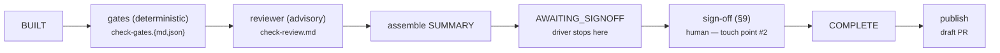

# Step 05 — Check: gates, reviewer, sign-off, and publish

← [04 Do](04-do.md) · [Index](README.md) · next: [06 Act →](06-act.md)

**Beat: Check.** The substance of the harness, and the biggest beat by far —
because Check isn't just gates and a reviewer. Per the model, **sign-off and
publish are steps of Check too**: gates and the reviewer run unattended
(**full** automation); sign-off is the human completing Check (**instrumented**
— touch point #2); publish is Check's closing work, turning an accepted bundle
into a contribution. One beat, four parts, only one of them human.



Two parts follow: [**how to use**](#how-to-use) it — the commands, and two
real worked examples (an accept, and a two-round iterate) — then
[**how it works**](#how-it-works) underneath: the 5/5/1 model, the leaves
involved, gate mechanics, the reviewer's isolation sandbox, SUMMARY assembly,
the C6 accept-guard, and how a batch publishes as waves.

## How to use

### The gates run automatically

The gates you wired in [step 01](01-render-and-integrate.md) run as part of
`pdca flow` — nothing to type. Each emits a row: check, result, oracle, and
whether it's gating. Here is the real `results/issue_11589/check-gates.md`:

```markdown
# Check gates — issue_11589

**Overall (gating): pass**

## Correctness (5)
| Check | Result | Oracle | Gating |
|---|---|---|---|
| C4 fix verified: test red pre-fix, green post-fix | pass | run-verify.sh | yes |
| (C1/C2/C3/C5 — none configured / judgment) | none | — | no |

## Conformance (5)
| Check | Result | Oracle | Rule | Gating |
|---|---|---|---|---|
| T1 structure | pass | gate.py T1 | 1 addon(s) conform | no |
| T2 shape | fail | gate.py T2 | __init__.py: no GPL header (doc16:99) | no |
| T3 runtime: core unit suite | fail | run-unit.sh | Trace/breakpoint trap (core dumped) [baseline] | no |
| T3 runtime: addon unit suites | fail | run-addon-unit.sh | pip install logs (3 failures) [baseline] | no |
| T4 contribution | pass | gate.py T4 | N/A: no commit-msg.txt | no |
```

**`Overall (gating): pass` even though three rows say `fail`.** The only gating
check — `C4-verify`, the red→green proof — passed, so the contribution is
*correct*. The failing rows are all **advisory**: a GPL-header gap in a file
the patch never touched, and two runtime suites failing with `[baseline]`
signatures (a pre-existing core segfault and an environmental pip issue). They
don't block — but they don't vanish either. They become NEEDS-HUMAN items,
below.

You can also run the gate set standalone, the same code the driver and CI both
call:

```bash
pdca gates 11589                # this bundle's gates, printed, nothing recorded
pdca gates --working-tree       # repo-scoped gates only — the CI merge re-gate
pdca gates --promotions         # advisory checks clean for their promote_after cycles
```

`--promotions` is the **promote-a-check** workflow: give a check
`promote_after = N` in `pdca.toml` and this lists the advisory checks that have
**passed in their N most-recent frozen cycles** — earned promotion from
advisory to gating. It's a hint; you flip `gating = true` yourself, nothing is
auto-mutated. That's the Act "promote a check" delta, with a concrete trigger
(issue #156).

If your project already single-sources its gates in its own runner (`cargo
xtask`, `make`, `just`, …), don't re-declare them in `pdca.toml` —
**delegate**. Set a runner and give each check a bare `subcmd`:

```toml
[gates]
runner = "cargo xtask"
checks = [
  { id = "C4-verify", tier = "C4", label = "fix verified red->green", subcmd = "verify", gating = true,  scope = "bundle" },
  { id = "T3-suite",  tier = "T3", label = "runtime suite",           subcmd = "test",   gating = false, scope = "repo" },
]
```

PDCA runs `cargo xtask verify` / `cargo xtask test` and maps the results onto
the 5/5/1 — the host runner stays the single source of truth; PDCA only
orchestrates it. A full `cmd` (e.g. `cmd = "cargo xtask ci"`) still works for
wholesale delegation. A missing runner surfaces as a clear failing row
(`runner '…' not found on PATH`), never a crash. Set it at render time with the
`gates_runner` copier question, or later in `pdca.toml`.

### Adding a second opinion

The `reviewer` leaf is configured for you already ([step 01](01-render-and-integrate.md)).
For **other lenses** — correctness bugs the patch introduces,
reuse/simplification/efficiency cleanups — add **advisory reviewer leaves**
(issue #64): an open `[[leaves.advisory]]` list in `pdca.toml`, each a
role-distinct, model-agnostic (`family` + `argv`) leaf. Each writes
`check-advisory-<id>.md`; its `- NEEDS-HUMAN —` findings fold into §6 like the
reviewer's, and they're **always advisory** (never gate). Condition one on a
brief field with `when = { field = …, substring = … }` (e.g. run a deeper
review only when the brief says so). A shipped `code-review` agent realizes
the correctness+cleanup lens for a `claude` instance; `family = "codex"` swaps
the vendor. A second shipped agent, `adversary` (issue #151), is a
**refutation** lens — it tries to *disprove* the red→green evidence and the
reviewer's verdict, defaulting to "refuted" when uncertain; the `pdca.toml`
example gates it on `Difficulty: high` so it runs only on the highest
blast-radius bundles.

**Automatic vendor complement (issue #200).** Cross-vendor decorrelation is the
ideal, but the builder that *actually* runs isn't fixed — an explicit `Do
model` (#167), difficulty routing (#134), or escalation (#135) can pick Codex
for one bundle and Claude for the next, which can leave a statically-configured
advisory *same-vendor* as the builder. Opt into
`[leaves.advisory_selection] mode = "vendor-complement"` to let the driver do
the pairing: it treats the `[[leaves.advisory]]` list as a **vendor pool** and
runs the single leaf whose `family` differs from the builder that ran. Declare
one leaf per vendor (same `role`, different `family`) and a Codex-built bundle
gets the Claude advisory while a Claude-built bundle gets the Codex one, with
no per-brief edits. If no leaf differs from the builder it falls back to the
first applicable leaf and files the lapse as a §6 `NEEDS-HUMAN` so you can see
decorrelation didn't hold.

### Trying the build by hand — `pdca try <id>`

Some §6 rows are irreducibly a **run-it-yourself** call — a GUI/visual repro,
or the validation act ("is this the right thing?") for a change no headless
test can exercise. `pdca try <id>` closes that gap: it **materializes the
patched build on demand from the bundle's `patch.diff`** and hands you the
terminal so you can drive the app and see the fix for yourself:

```bash
pdca try 11589
```

It runs the project's `[manual_test].cmd` (e.g. `python -m gramps`) from
`$PDCA_WORKTREE`, and imposes no timeout — you quit the app to return. It's
**advisory**: it decides nothing and mutates nothing in the bundle; you record
what you saw in a Manual-verification note and carry it into the §9 sign-off,
below. It works for **any built/parked bundle in turn** — exactly the
batch-then-review cadence, where you `pdca try` each bundle as you sign it off.
Needs `[driver].worktree` on and a configured `[manual_test].cmd`; otherwise it
prints a one-line hint and changes nothing.

### What a real §6 looks like, and clearing it

The driver folds brief + gates + review into `SUMMARY.md`. Here is the real
§6 from issue 11589 — the advisory gate failures above, turned into explicit,
adjudicable questions (shown already cleared, `- [x]`):

```markdown
## 6. NEEDS-HUMAN — items the human must clear before sign-off
- [x] T2 — Gate failed on `__init__.py: no GPL licence header` — but no
  `__init__.py` appears in `patch.diff`. Both files the patch *does* touch are
  shape-clean. The violation sits in an untouched bundle file → human must decide
  whether the pre-existing gap blocks this contribution.
- [x] T3 — All three runtime suites are `fail` but the failure modes are not
  plausibly caused by a 2-file addon change: core unit `Trace/breakpoint trap
  (core dumped)` (segfault in gramps core, which the diff never touches),
  addon-unit `pip install logs` (env), interface `_ErrorHolder`. Marked
  "whole-suite baseline" — human must diff against baseline to confirm these are
  pre-existing, not regressions.
- [x] T5 — Always-human element. Overall contribution judgment — code quality,
  idiom fit, whether the sibling-detection approach is the right shape.
- [x] V — Validation — Whether the change solves the user's problem against the
  *real* FilterRules pack layout (13 rule pairs in one dir), not just the temp-dir
  stand-in, is a fitness-to-purpose call only the human can make.
```

This is the harness working as designed: the deterministic gate proved
correctness (`C4` green) and *surfaced* everything it couldn't adjudicate — a
header gap of ambiguous scope, environmental test noise, and the two
irreducibly human checks (`T5` judgment, `V` validation) — as a short, specific
checklist. You aren't re-reading the whole diff; you're answering four pointed
questions.

### Signing off — the four dispositions

```bash
pdca signoff <id> --accept        # the fix is good → COMPLETE, ready to publish
pdca signoff <id> --iterate-do    # right spec, wrong build → rebuild against same brief
pdca signoff <id> --iterate-plan  # the spec itself was wrong → re-author the brief
pdca signoff <id> --discontinue   # this doesn't belong in the cycle → abandon
```

Add `--by "Name"` to set attribution and `--delta "…"` to record the rationale
on an iterate. `--accept` is refused while any §6 item is unchecked (the C6
guard, below); the other three are not — you can redirect or abandon a bundle
with §6 still open.

**The simple case.** For issue 11589, the gates proved correctness and the four
§6 items above were all cleared, so the maintainer accepted. The real
`results/issue_11589/SUMMARY.md` §9:

```markdown
## 9. Check sign-off                     ← human completes Check here
- Disposition confirmed / overridden:
- Outcome: merged-wider
- Iteration delta (if iterating):
- By / date: Eduard Ralph / 2026-06-06
```

`Outcome: merged-wider` ⇒ state `COMPLETE`. The bundle is frozen and ready for
publish, below.

**The instructive case.** Acceptance is the boring path — the cycle earns its
keep on **iteration**, when you catch something the gates can't. gramps issue
46 (a GraphView import-safety fix) took **two** iterations before it was
accepted. The brief's own carry-forward records *why* the first attempt was
rejected — a real `--iterate-do` rationale, verbatim:

```markdown
## Iteration 1 — carry-forward (from the previous attempt)
- Sign-off rationale: Reject: the regression test reimplements GTK load/version-
  pinning (test_graphview_import.py:80-82, top-level `import gi` +
  gi.require_version("Gtk","3.0")). GTK loading/pinning is already owned by gramps
  at runtime and by PR 950 in unit testing, so this machinery must not be in the
  addon test — it is redundant and is the likely cause of the two T3 addon-unit
  exit-2 collection aborts. Rebuild the test without any manual gi/Gtk pinning;
  keep the production change (removal of the two import-time raises) as-is.
  Re-run T3 addon-unit and E2E ...
```

What happened mechanically:

1. **Iteration 1** built a fix whose *production change was correct* but whose
   *test* carried redundant GTK-pinning machinery. The C4 gate went green (the
   fix worked), but the maintainer noticed the test introduced two new
   `[delta]` failures in the T3 addon-unit matrix — a regression the test
   itself caused. (`[baseline]` = a known pre-existing failure, ignore;
   `[delta]` = new, your fix may have caused it.)
2. The maintainer ran `pdca signoff 46 --iterate-do --delta "rebuild the test
   without the gi pin; keep the production change"`. The driver archived the
   attempt into `iteration-v1/`, reverted to `PLANNED`, and re-ran the
   builder — which got the rejection rationale folded into the brief (above),
   so it didn't repeat the mistake.
3. **Iteration 2** rebuilt the test without the pin. Accepted:

```markdown
## 9. Check sign-off
- Outcome: merged-wider
- Iteration delta (if iterating): [iteration 2 — rebuilt test without gi pin]
- By / date: Eduard Ralph / 2026-06-13
```

The lesson: **the deterministic C4 gate said "correct," and it was right — but
"correct fix" is not "good contribution."** A test that pins GTK is correct
*and* redundant *and* regression-inducing; only the human reading the §6/§7
material caught it. The harness didn't prevent the mistake — it **surfaced it
cheaply**, gave the human a clean "reject with reason" lever, and **carried
the reason forward** so the rebuild started smarter.

### Publishing the accepted fix

**Accept publishes by default everywhere** (#97): both `pdca flow` and a
standalone `pdca signoff <id> --accept` run publish on an accept, so "approved"
doesn't silently stay "unpublished"; pass `--no-publish` to opt out (then it's
*deliberately* unpublished, not by accident). You can also run it standalone:

```bash
pdca publish 11589              # open the draft PR
pdca publish 11589 --dry-run    # print the git/gh plan without pushing
```

`pdca status` (and bare `pdca`) shows each `COMPLETE` bundle's publish state —
`[PR <url>]` when a PR was opened, `[unpublished]` when it wasn't (dry-run /
no-target / failed / not-yet-run), `[close: no PR]` for a close/no-fix bundle —
so an accepted-but-unpublished cycle is visible at a glance. It writes
`publish.json` into the bundle and uses the project's PR conventions from
INTEGRATION §8. For gramps that's a four-section body (Root cause / Fix /
Verified against / Test), and — because 11589 touches an addon — an `## Affected
addon` section that @-mentions the addon's maintainer (INTEGRATION §10).

In gramps' git history you can see cycles land this way — each result bundle
gets a branch and a PR:

```
c52c6a4 Merge pull request #105 from eduralph/results/issue-46-graphview-import
f1092ca results(46): record published GraphView import-safety cycle
```

That's one full cycle, [steps 03–05](03-plan.md), from tracker issue to merged
record.

**Undoing one.** If a landed fix turns out wrong, `pdca revert <id>` undoes the
contribution from its recorded `publish.json`: a **merged** PR gets a draft
**revert PR** (reverse-applying the bundle's own `patch.diff` onto the base —
no guessing the merge commit), and an **open** one is **withdrawn**
(`gh pr close --delete-branch`). STOP discipline holds — the revert PR opens as
a draft for you to merge (issue #158).

---

## How it works

### The leaves Check uses

Three leaves, plus an optional pool:

- **`reviewer`** — headless, the decorrelated second opinion. Covered in full
  below — what it reads, its isolation sandbox, and the security model around
  it.
- **`signoff`** — interactive, touch point #2. There's no model judgment here;
  the leaf just instruments the human recording §9. `pdca signoff` (above) is
  the one-command capture.
- **`publisher`** — interactive, Check's closing work. Turns an accepted bundle
  into a draft PR per your project's conventions (INTEGRATION §8).
- **`[[leaves.advisory]]`** (optional) — any number of extra reviewer-shaped
  leaves for other lenses (correctness, cleanup, refutation). Never gate.

### The 5/5/1

Check asks three different *kinds* of question, and the 5/5/1 names their
shape as much as their content: correctness is a **chain** (five ordered,
dependent steps — you can't verify without a reproduction), conformance is a
**stack** (five independent layers checked in parallel — Tier 1 passing
doesn't gate Tier 3), and validation is one **indivisible act** — it doesn't
decompose, because judgment of fitness-to-purpose isn't a checklist. That
shape is exactly the deterministic/human boundary: what can be a chain or a
stack can be automated; what's irreducibly one judgment call can't.

#### Correctness — is it *right*, relative to the spec?

| Step | What it asks | Who answers it |
|---|---|---|
| `C1` Spec | What does "fixed" mean? | **Input** from Plan (`brief.md`'s Success criterion) — not work Check performs |
| `C2` Reproduction | Can the defect be made to fail, on demand? | **Gate** — the red proof, pre-fix |
| `C3` Change | What did Do actually write? | **Input** from Do (`patch.diff`) — not work Check performs |
| `C4` Verification | Does the shipped test now pass? | **Gate** — the green proof, post-fix |
| `C5` Causal adequacy | Does the fix address the *root cause*, or just this symptom? | **Judgment** — reviewer (advisory) + you at sign-off |

`C1` and `C3` carry no tooling of their own — they're listed to keep the chain
complete, but they're artifacts Check *receives*, not artifacts Check
*produces*. `C2` and `C4` are the two gates you've already seen: they're what
`C4-verify` in the real gate table above actually is — one runner asserting
red-without-the-fix and green-with-it. `C5` is where "the test passed" stops
being enough: a fix can make `C2`→`C4` go red→green by patching the symptom
one call site at a time and still be structurally wrong — `C5` is the reviewer
(and, if it can't settle it, you) asking whether the *class* of defect named in
the brief's `Invariant to restore` ([step 03](03-plan.md)) is actually gone.

#### Conformance — is it *well-formed*, independent of whether it's right?

| Tier | What it asks | Who answers it |
|---|---|---|
| `T1` Structure | Is the change shaped where the project expects it — right directory, right registration, required files present? | **Gate** |
| `T2` Shape | Does the code follow the project's own style/pattern rules — the ones a linter or a semgrep rule can catch? | **Gate** |
| `T3` Runtime | Does it actually *run* — dependencies resolve, no crash on load, existing suite still green? | **Gate** |
| `T4` Contribution | Does the commit/PR itself follow convention — message format, branch target, tracker trailer? | **Gate** |
| `T5` Judgment | Is it good code *as a contribution* — idiom fit, one logical fix, scope creep? | **Judgment** — reviewer (advisory) + you at sign-off |

You've already seen these in the real gate table earlier on this page: T1
"1 addon(s) conform," T2 "no GPL header," the two T3 runtime rows, T4 "N/A: no
commit-msg.txt" — those five rows *are* T1–T5, run against one real bundle.
Notice conformance says nothing about whether the fix *works* — a change can
be perfectly well-formed (right directory, clean style, green suite,
conventional commit) and still be the wrong fix, or vice versa. That
independence is why they're a stack, not a chain: a `T2` failure never blocks
on a `T1` result, and neither has anything to do with `C4`.

#### Validation — is it the *right thing*, at all?

One question, never split further: given everything the cycle has produced —
the spec, the report, the fix — should this ship *at all*? A conformant,
causally-adequate fix can still be validation-`FAIL` if it solves a problem
nobody has, scopes wider than the report warranted, or the "root cause" it
targeted isn't actually what the user meant by the bug. There's no tier
ladder here because fitness-to-purpose isn't decomposable into independent
checks the way conformance is — it's always the reviewer attempting it,
advisory, and always you confirming it at sign-off; no gate ever touches it.

#### Why the shape matters

Every cell above is exactly one of three things: an **input** (`C1`, `C3` —
not Check's work), a **gate** (`C2`, `C4`, `T1`–`T4` — deterministic,
mechanical, blocks accept on fail), or **judgment** (`C5`, `T5`, validation —
always routes to the reviewer first and you last, never gates). That
three-way split is the same one [auto-iterate](07-crosscutting.md#auto-iterate-the-driver-deciding-for-itself)
reads to decide whether it's safe to rebuild without asking you: only a §6
item tagged `gate` is eligible — the driver can plausibly fix a `C2`/`C4`/`T1`–`T4`
finding by rebuilding, but it can never rebuild its way past a `C5`/`T5`/validation
finding, because those were never mechanical questions to begin with. A gate
can also come back **`unverifiable`** — it genuinely couldn't run its check
(a missing fixture, a skipped environment) rather than having run and failed —
which is neither pass nor fail; it routes to §6 like a judgment cell would,
because "we don't know" and "we checked and it's wrong" need different
responses from you. And it can come back **`deferred`** — it ran, but the thing
it audits doesn't exist yet (the contribution check lints the PR body and commit
message, which get drafted at publish, after Check). That one is *not* routed to
§6: its real verdict is owed to the gate that re-runs the row before anything is
pushed, not to you, so it shows in the matrix and §5 with its reason and nothing
lands on your checklist.

The three mechanisms — gates, reviewer, assembly — run in that order, next.

### Gates — the deterministic oracles

Gates are deterministic Check commands with a pass/fail result, each tagged
**gating** (blocks a sign-off) or **advisory** (informs only). `Overall
(gating)` is the AND of every gating row; any advisory row can fail without
touching it. That split is the whole point: it's why a pre-existing
environmental failure never blocks a correct fix, and why a real regression
still can't slip through as an advisory footnote — a **gating** row that
hard-FAILS also lands in §6 (issue #166), covered under the C6 guard below.

### Reviewer — the decorrelated second opinion

The `reviewer` leaf runs against `{patch.diff, test, brief.md,
check-gates.json}` — **not** `build-notes.md` ([step 04](04-do.md) explained
why). It re-runs the asserted evidence (stash → confirm red, unstash → confirm
green), re-checks that cited `path:line`s exist on the target branch, and flags
scope creep. Its output, `check-review.md`, is **advisory** — it annotates, it
never gates. The blocking path contains no LLM at all.

The reviewer runs in an isolation sandbox (only `{patch.diff, brief.md,
check-gates.json}` plus the round's `gate-logs/` are present — the frozen gate
evidence, so a row it cannot re-run is adjudicated from the log its `log` key
names rather than escalated, issue #403), so the driver hands it a read-only grounding
target as **`$PDCA_TARGET`** (for a `claude` reviewer also via `--add-dir`).
That target is the **per-cycle worktree** ([step 04](04-do.md)) — pinned to the
*same* base the gates ran against and carrying the patch — so a stale or
unreadable sibling checkout can't drift the reviewer's grounding (issue #120);
when worktree isolation is off it falls back to the brief's target checkout,
freshly fetched (refs only — never resetting your working tree). The reviewer
grounds every citation there and is told **not** to wander into other
checkouts on the machine — without this it can't ground, or hunts the
filesystem for "the target" (issue #75).

#### Runtime tests that bind a loopback socket

That isolation sandbox is a *temp working directory*, not an OS jail. The jail
a leaf actually runs under is **Claude Code's own** (bubblewrap + seccomp on
Linux), and by default it refuses `bind()` on a loopback socket — so a runtime
test that does `TcpListener::bind("127.0.0.1:0")` (a loopback-gRPC server, a
test HTTP listener) panics with `Operation not permitted` *before its
assertion runs*. Compile and non-socket unit legs pass; only the socket-backed
path fails, so C2/C4/T3 can never earn an automated red→green (issue #261).

The rendered project's `.claude/settings.json` therefore sets:

```json
{ "sandbox": { "network": { "allowLocalBinding": true } } }
```

and the driver **seeds that one setting into the leaf's temp cwd**, because
Claude Code loads project settings relative to the subprocess cwd — the same
walk-up that finds `.claude/agents`.

What travels is an **allow-list of named `sandbox.network` keys** — never a
copy of the `sandbox` block, and never `permissions` (whose allow-list carries
`Edit`/`Write`). In particular `sandbox.excludedCommands`, covered just below
for your **gates**, makes a command bypass the sandbox *entirely*: carrying it
into the reviewer's cwd would let the reviewer run your test runner
unconfined, so it is never seeded however you configure it. Widening the seed
means adding a key to that list, deliberately.

#### Letting the reviewer settle prior art mechanically (opt-in)

The reviewer's prior-art check (`T4` contribution / `T5` judgment) spans
merged history *and* the **closed/rejected-PR corpus**. Merged history is
local (a plain `git log --all` over the changed paths), but the closed corpus
needs `gh pr list --state closed` → `api.github.com`. The sandbox blocks
network by default, so that half can't be settled and the check is correctly
forced NEEDS-HUMAN on **every** bundle — a standing per-bundle tax on a check
that could be mechanical (issue #277).

The shipped `.claude/settings.json` documents the grant but leaves it **off**:

```json
{ "sandbox": { "network": { "allowLocalBinding": true, "allowedDomains": [] } } }
```

Opt in by naming the hosts:

```json
"allowedDomains": ["github.com", "api.github.com"]
```

An **empty list seeds nothing** — that is what "off" means here — so this is
an explicit choice, not a default. Scoped to the hosts you name;
`deniedDomains` is carried too.

Domain scoping is **claude** only. A `codex` leaf has no `allowedDomains`
equivalent — its `--sandbox workspace-write` denies the network wholesale — so
it takes the all-or-nothing `network_access` grant described under
[Docker gates](#docker-backed-conformance-gates-opt-in) below, which reaches
`api.github.com` too and settles its prior-art check the same way.

#### Docker-backed conformance gates (opt-in)

A conformance gate that brings up a live cluster (`docker compose` → etcd /
TiKV / FDB) is **denied the Docker socket inside the leaf sandbox — even on a
Docker-capable host**. The runtime leg skips, its evidence can never be earned
at Check, and it defers to a human-run confirmer on *every* bundle. That is the
harness failing at its own purpose: the maintainer becomes the bottleneck for
a check that ought to be mechanical (issue #276).

Name the commands that need Docker, and **only those** run outside the
sandbox:

```toml
[leaves.sandbox]
unsandboxed_commands = ["cargo xtask fdb-conformance", "cargo xtask etcd-conformance"]
```

Every other Bash line the leaf writes stays fully confined. Empty (the
default) means no exemption at all, and a Docker-backed leg goes on deferring
to a human.

**"Only those" is enforced, not merely intended** — and a list of names on its
own enforces nothing. It takes three things, because there are three ways the
boundary evaporates that the list doesn't cover:

0. **No sandbox at all** — two ways, both closed by seeding `enabled: true`
   *and* `failIfUnavailable: true`.

   `sandbox.enabled` **defaults to false**, and (2) below deliberately drops
   your *user-scope* settings — which is exactly where an operator's
   `sandbox.enabled: true` normally lives. So without seeding it, bounding the
   exemption would **remove the very sandbox it claims to bound**, and every
   command would escape.

   And the sandbox does not fail closed on its own: if `enabled` is true but
   its dependencies (`bubblewrap`, `socat`) are missing, Claude Code *disables*
   it, warns, and runs every command unconfined. `failIfUnavailable` — which
   has effect **only when `enabled` is true** — makes the leaf **refuse to
   start** instead. A bounded exemption on top of no sandbox is not bounded; it
   is nothing. `pdca doctor` checks the same dependencies *before* a run (they
   are **required** rows); this catches the operator who skipped it.
1. **The escape hatch.** The harness seeds `allowUnsandboxedCommands: false`
   beside the list. Claude Code defaults that key to **true**, and while it is
   true the model may retry *any* sandbox-denied command with the
   `dangerouslyDisableSandbox` parameter and have it run unconfined. With it
   false, that parameter is ignored outright.
2. **Scope concatenation.** The leaf runs with `--setting-sources project`, so
   it loads *only* the settings the harness seeds. Array-valued settings
   **concatenate** across scopes (user → project → local → managed), and the
   union is **monotonic** — no scope, not even managed policy, can remove what
   a lower one added. So your own `~/.claude/settings.json`
   `excludedCommands` (your *interactive* exemptions — a broad `docker *`)
   would merge straight into the leaf, and nothing the harness writes could
   subtract them. The list would be a *floor*, not a ceiling. The only fix is
   to not load that scope.

> **The one scope the harness cannot bound: enterprise managed policy.**
> `--setting-sources` excludes *user* and *local* settings, but Claude Code
> **always** loads managed policy (`managed-settings.json`) regardless. Since
> array settings only ever concatenate, a managed policy carrying
> `sandbox.excludedCommands` widens the leaf's exemption and **nothing the
> harness can do will narrow it** — the list stays a ceiling with respect to
> *your* settings, but not with respect to *your organisation's*. That is by
> design on Claude Code's side: managed policy is meant to outrank everything.
> If your org sets one, read it before relying on the boundary below. The
> harness cannot, and does not, override it.

> **The cost of (2).** The leaf no longer reads your user-scope settings at
> all. If your **auth** lives there (`apiKeyHelper`, or `env.ANTHROPIC_API_KEY`),
> move it into the environment or the leaf will fail to start. It fails
> loudly, and the error lands in the bundle's `*.error.log`.

Both ride *with* the exemption: an instance that names no command keeps
today's behaviour exactly, rather than having a policy imposed on it. And this
is **claude-family only** — a family that cannot be confined to the harness's
own settings (codex) cannot have a bounded exemption, so the harness
**refuses** the grant there rather than hand out an unbounded one.

**Why a named command, and not a socket grant.** The sandbox schema *does*
offer `allowAllUnixSockets`, which would reach the Docker socket too — but it
hands **every** command the leaf runs access to **every** unix socket. And the
Docker socket on a root-owned daemon is effectively root on the host: anything
that can talk to it can start a container with `-v /:/host`. Check which you
have:

```bash
ls -l /var/run/docker.sock      # root:docker  → the daemon runs as root
```

The reviewer leaf has `Bash`. Giving it a root-adjacent socket for *any*
command it cares to write is a far larger grant than letting *one command you
wrote* run unconfined. So the harness does not seed `allowAllUnixSockets` at
all — it is not in the allow-list, and setting it has no effect on a leaf.

**Hardening.** A **rootless** daemon (podman, or rootless `dockerd`) makes
socket access user-level instead of root-level, which de-fangs this entire
class of risk. Prefer it where you can. Match the command precisely, too —
this is a capability, so `docker *` hands the leaf far more than
`cargo xtask fdb-conformance` does.

**The exemption list is harness-owned, on purpose.** The driver never inherits
your project's own `.claude/settings.json` `sandbox.excludedCommands` — that
is *your* gate workaround, and a leaf must not silently acquire whatever you
exempted for CI. A leaf's exemption is declared once, deliberately, in
`pdca.toml`.

#### The codex leaf reaches Docker a different way

Everything above is the **claude** shape. A `codex` leaf's
`--sandbox workspace-write` denies the Docker socket too, but it cannot take
*any* of it: it does not read the settings the harness seeds, so it can
neither be given a per-command exemption nor be confined to one. The harness
therefore **refuses** `unsandboxed_commands` on codex rather than hand out an
unbounded grant, and points you here.

Its denial is **not a filesystem denial** — a relayed socket in a directory
codex *can* write is refused just the same. It is the seccomp/network layer.
So no path grant fixes it, and only one thing does:

```toml
[leaves.sandbox]
network_access = true       # codex: open the leaf's socket/network layer
```

The driver then passes `-c sandbox_workspace_write.network_access=true` to
codex leaves. That reaches the Docker socket **and** `api.github.com`, so it
settles the prior-art check
([above](#letting-the-reviewer-settle-prior-art-mechanically-opt-in)) at the
same time.

**The two grants have different shapes, and neither is strictly tighter.**
Read them together:

| | what escapes | what stays confined |
|---|---|---|
| **claude** — `unsandboxed_commands` | a **named command**, fully (filesystem too) | every *other* command |
| **codex** — `network_access` | the **socket/network layer**, for *every* command (no per-domain scoping) | the **filesystem**, for every command |

So they are deliberately **separate keys**. `unsandboxed_commands` promises
*"only these commands leave the sandbox"* — a promise codex's grant would not
keep, since it frees the network for every command the leaf writes. Naming a
command therefore never implies the network grant; you opt into each
explicitly.

Both are moot against a **root-owned** daemon, mind: anything that can talk to
that socket can start a container with `-v /:/host`, so the filesystem
confinement codex retains buys little there. The rootless hardening above is
the real answer for either family.

This covers the **reviewer and advisory leaves**. It does *not* cover the
**gates**: gate commands are plain subprocesses of `pdca`, so they inherit
whatever sandbox the operator's own shell already has. If you launch
`pdca flow` from inside a sandboxed agent shell, a gate that binds loopback
still fails. Run `pdca` from an unsandboxed shell, or exempt the test runner
via `sandbox.excludedCommands` in your own settings (that exemption stays in
*your* settings — the driver never seeds it into a leaf).

### Assembly — the SUMMARY the human signs

The driver folds brief + gates + review into `SUMMARY.md`, a 10-section
document. The two sections that drive the human decision are **§6
NEEDS-HUMAN** (what you must clear) and **§9 Check sign-off** (where you
record the verdict). When `SUMMARY.md` exists with an empty §9, the bundle is
`AWAITING_SIGNOFF` and the driver **stops**.

#### An unregistered dependency is a §6 item (issue #263)

§6 is also where an **unregistered dependency** surfaces. When a slice needs
something a human must install or provide — a build tool (`protoc`), a runtime
service (Docker, a live etcd) — the brief's `External dependencies` names it
as a **backticked token equal to the `id` of a `[[doctor.checks]]` row** in
your `pdca.toml`:

```toml
[[doctor.checks]]
id   = "protoc"                          # ← the brief writes `protoc`
cmd  = "protoc --version"                # how to detect it
hint = "apt install protobuf-compiler"   # how a human provides it
```

At Check the driver reconciles the two. A declared dependency with **no row
that detects it** becomes a §6 item, and the C6 guard below holds `--accept`
until the row exists. That makes registration a *forcing function* rather than
advice: `pdca doctor` prompts you with the install hint up front, instead of
the dependency surfacing mid-cycle as a cryptic build failure. This is the
Check-time backstop for the same reconciliation the [dependency guard](03-plan.md#entry-and-exit-the-guards-around-plan)
already runs at Plan exit and again at Do's own exit
([step 04](04-do.md#the-leaf-and-the-guards-around-it)) — three chances to
catch it, never a fourth path to a verdict.

The reviewer can't do this — its sandbox has no `pdca.toml`, so it cannot know
which rows exist — and it isn't a judgment call anyway; it's set membership,
so the driver decides it deterministically. Two consequences worth knowing:

- **A row without a `cmd` registers nothing.** `pdca doctor` skips it, so it
  would never detect anything; it does not silence the §6 item.
- **A dependency nothing can detect is exempt.** A required *topology* — a
  ≥3-replica cluster, a partition-capable stack — goes in plain prose
  (unbackticked), or as a backticked token annotated
  `` `x` (no-check: <why>) ``.

Rows are read from `pdca.toml` as it stands when Check runs, so a row that
Plan registered — or that you pasted in from the builder's proposal at Do —
counts within the same cycle.

### The C6 accept-guard

One rule connects §6 to sign-off: **you cannot `--accept` while any §6 item
is unchecked.** That's the `C6` guard. It's why the §6 items above are `- [x]`
in the accepted example — the human worked them before accepting.
(`--iterate-*` and `--discontinue` are *not* guarded — you can redirect or
abandon a bundle with §6 still open.) A **gating** gate that hard-FAILS
(`overall = fail`, not just an advisory row) also lands in §6 (issue #166), so
the guard blocks accept on a red gate too — you clear it with a conscious
override, `--iterate`, or `--discontinue`, never by it slipping silently to
COMPLETE.

### The four dispositions, mechanically

Each disposition maps to a state transition the driver applies the instant
you record it:

| Disposition | §9 outcome | New state | What the driver does |
|-------------|-----------|-----------|----------------------|
| `--accept` | `merged-wider` | `COMPLETE` | Freezes the bundle; publish can run |
| `--iterate-do` | `iterated-to-Do` | → `PLANNED` | Archives Do+Check into `iteration-v<N>/`, keeps the brief, re-runs the builder |
| `--iterate-plan` | `iterated-to-Plan` | → `UNPLANNED` | Archives the **whole attempt incl. brief**, you re-spec |
| `--discontinue` | `discontinued` | `DISCONTINUED` | Records §9, no transition, drops from the pending set |

> `--discontinue` is the disposition this harness version
> ([v0.18.0](https://github.com/eduralph/pdca-harness/releases)) unified — the
> action, the `discontinued` §9 outcome, and the terminal `DISCONTINUED` state
> now all share one word. Use it for work that, on inspection, doesn't fit the
> cycle (handled out-of-band, duplicate, won't-fix) — a deliberate abandon,
> independent of §6.

**Auto-iterate** — `[driver].auto_iterate = true` lets the driver record
`iterate-do` for you when Check's §6 has implementation-only findings and
nothing you must see first, so Do→Check keeps iterating while the reviewer
keeps finding things only Do can fix. It never accepts, never ticks a `- [ ]`,
and is bounded by `max_auto_iters` rounds — full mechanics, the eligibility
rule, and its three guarantees are in
[step 07](07-crosscutting.md#auto-iterate-the-driver-deciding-for-itself).

### Publish's STOP discipline, and batches

The PR opens as a *draft*, and on the normal single-cycle and `stack`-mode
paths a human marks it ready — the harness never does. gramps' governance
makes this explicit (INTEGRATION §10): *"Eduard opens fork PRs as draft, marks
ready himself; builder commits and stops — no push/PR-open/ready-mark without
explicit instruction."* The one carve-out is the opt-in `wave_mode = "merge"`,
where the driver readies and merges each *non-final* wave's PRs to advance the
base; even there the **final** wave's PR stays a draft for your ready-mark.

This holds for a **batch**, too. A multi-id `pdca flow` runs the batch as
dependency waves ([09 parallel lanes in the spec](../template/PCDA/quality-cycle/09-parallel-lanes.md);
mechanics in [step 07](07-crosscutting.md#waves-in-execution)); in the default
`stack` mode each wave's accepted work is folded onto a run-scoped integration
branch the next wave builds on, and each dependent opens a **stacked** draft
PR — the harness still never merges, so you review and merge the stack
bottom-up yourself. Only the opt-in `[driver].wave_mode = "merge"` (own-repo /
CD, where you hold merge rights on the base) relaxes this, `gh pr merge`-ing
each wave before the next builds.

State: `COMPLETE`, published. On to the cross-cycle beat — [step 06](06-act.md).

← [04 Do](04-do.md) · [Index](README.md) · next: [06 Act →](06-act.md)
