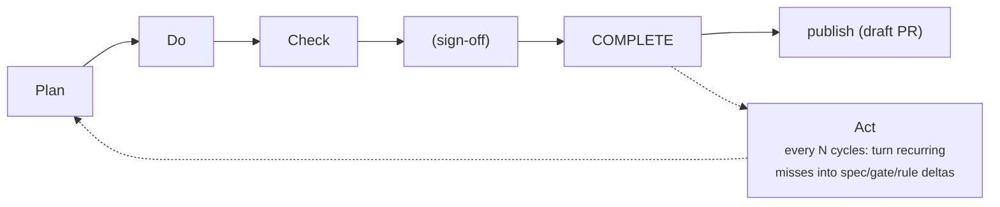

# Step 06 — Act: improve the process

← [05 Check](05-check.md) · [Index](README.md) · next: [07 Cross-cutting →](07-crosscutting.md)

**Beat: Act.** Touch point #3, and the last one. Plan/Do/Check operate on **one
contribution**. Act operates on the **process itself**, across *many* completed
cycles, on its own cadence (every N cycles, or weekly — *not* per-cycle). It's
what closes the PDCA loop: turning what several cycles exposed into a
permanently better baseline, so the *next* Plan starts from firmer ground.

Two parts follow: [**how to use**](#how-to-use) it — the commands, and two real
process deltas it produced — then [**how it works**](#how-it-works)
underneath: the leaf, what it reads (and explicitly refuses to do), where a
delta can land, and the cadence that keeps it from firing on noise.

## How to use

```bash
pdca act index                              # read-only: frozen cycles + recurring signals
pdca act log --date 2026-06-12 --append     # scaffold a dated entry into process/act-log.md
pdca triage <pr>                            # ingest a published PR's external review findings
```

Act reads the `COMPLETE` bundles' SUMMARYs — especially §6 (what needed a
human), §7 (what stayed unproven), and §10 (Act candidates the cycle flagged)
— looking for **patterns**. A one-off is noise; the same gap across three
cycles is a process defect.

### A real Act entry

This is from `gramps-testbed-v2/process/act-log.md` (2026-06-12), and it's the
clearest demonstration of why the beat exists. A maintainer reviewing the
`glade-setattr` cycle's published PR was asked to list a new `.py` file in
`po/POTFILES` — a documented rule **no gate owned**:

```markdown
# Act review — 2026-06-12 — cycles considered: glade-setattr (PR #2356 review feedback)

## What the cycles' records exposed
- A documented doc-16 MUST with no owner in the cycle — surfaced by a maintainer
  at review, not by any gate. Nick-Hall asked for the new test file to be listed
  in `po/POTFILES.{in,skip}`. The rule is explicit and sourced ... It is not
  exotic — it simply has no encoding in our T1–T4 ladder.
- The omission fell through every beat. Plan: the brief never stated the
  obligation. Do: the builder has no independent doc-16 checklist. Check/gates:
  T1 is addon-only; T2 checks file *shape*; T4 checks the commit/PR *wrapper* —
  none implement doc 16 §Translation Files. New-file→manifest registration falls
  in the gap between T2 (shape) and T4 (wrapper); neither owns it.

## Process deltas (candidates — routed for engineering, NOT applied here)
- Gate (highest-value): add a bundle-scoped, deterministic check — for a *core*
  bundle whose `patch.diff` adds a `.py` file, assert it appears in
  `po/POTFILES.in` or `po/POTFILES.skip`. Directly implements doc 16:99-100, is
  target-aware (core-only), and needs no Docker. Home: extend `t2_shape.py`.
```

Trace the loop: a human review comment (§ outside the gates) → Act
*generalizes* it ("this will recur on every core bundle that adds a file") →
a concrete process delta (a new gate) → which, once built, means **the next
cycle's gates catch it automatically** instead of a maintainer catching it at
review. That is the "→ back to Plan with a better baseline" arrow made
operational.

Another entry shows Act tightening the *spec*, not the gates — the
`issue_8653` cycle shipped a test that exercised a hand-ported copy of
production rather than production itself; only the human's T5 judgment caught
it:

```markdown
- Reference (applied): new principle §3.4 — test the production path: the success
  evidence MUST exercise the production path; a parallel re-implementation that
  mirrors production is not acceptable evidence. (docs/principles.md §3.4)
- Spec template (applied): brief Test file field now reminds that the test must
  drive the production path, not a parallel copy. (templates/brief.md.tpl)
```

That second delta is now also a **mechanical** check you can wire in: the
reference `scripts/checks/test_exercises_production.py` (a `[[gates.checks]]`
example, issue #154) asserts each *added* test file imports the production
package and declares itself UNVERIFIABLE → §6 when it can't — promoting "test
the production path" from a human-only T5 judgment to a
deterministically-surfaced one.

### Closing the loop — the process-delta ledger

A delta is only worth anything if it *works*. Act keeps a
`process/act-ledger.json`: each recurring signal it surfaces is tracked
`open`; once you land the fix you run

```bash
pdca act resolve "<signal>" --location <path:line>
```

to mark it **applied**; and on a later review Act flags any applied delta
whose miss **recurs** in a cycle frozen after the applied date — a loud
"⚠ Ineffective deltas" section in `act index` / the `act log` scaffold. So Act
audits its own prescriptions instead of writing them and forgetting.

### External review findings — `pdca triage` (issue #316)

The maintainer review on a *published* PR is the outer loop's highest-value
signal — and, until someone transcribes it, invisible to Act. `pdca triage`
does the transcription:

```bash
pdca triage https://github.com/OWNER/REPO/pull/123   # or OWNER/REPO#123, or a bare number with --repo
```

It pulls the PR's reviews and review comments via `gh api`, classifies each
finding (**BUG / CONVENTION / NOISE / TEST-GAP** — keyword heuristics, tunable
from the instance rubric's class list), and routes by class: a BUG on a merged
PR files a tracker issue whose body carries a carry-forward note; CONVENTION /
NOISE / TEST-GAP append candidate gate-row, rubric-line and rubric-exclusion
entries to `process/act-log.md`. Every finding also registers in the Act
ledger under a class-keyed signal (`codex-pr:<slug>`), so the ineffective-delta
audit above covers external findings too: a class that recurs *after* its
process delta was applied gets flagged. It **proposes only** — it never edits
`pdca.toml` or the rubric — and re-running the same PR ingests only findings
that arrived since the last run.

---

## How it works

### The leaf Act uses

Act has one leaf — `act`, interactive, like `planner` and `signoff`: the human
touch point is the whole beat, not a step inside it. The leaf instruments the
process — presenting the bundle index and recurring-signal candidates — but
`pdca act index`'s pattern-detection and the ledger are pure code; the leaf
only helps you draft the dated entry.

### What Act reads, and what it explicitly does not do

Act reads `COMPLETE` bundles only — frozen records, never anything in-flight.
What it explicitly does **not** do: re-decide any disposition, re-run the
suite, or write the next brief. It generalizes a pattern into a *candidate*
delta; a human still judges what to actually change (what rule to add, which
template field to revise, whether to retire a check) — the bundle index
surfaces patterns, the human decides.

### Where deltas land

Act deltas land in five places: the **spec template** (a brief field), the
**ruleset** (a written rule), the **gates** (a new/promoted check), the
**agent role prompts** (`agents/*.md`), or the **orchestration**
(driver/state). Each is a permanent improvement to the baseline every future
cycle starts from — the next Do should not recreate the issue the previous Act
tried to eliminate; if it does, the Act wasn't effective (which is exactly what
the ledger's "⚠ Ineffective deltas" check is for).

### Cadence — why Act doesn't fire every cycle

`[driver].act_cadence` (default `5`) is why "every N cycles, not per-cycle" is
a real mechanism, not just a suggestion: `pdca flow` auto-runs Act only once
this many cycles have frozen **since the last Act review**, counted across
`flow` invocations (five separate one-bundle flows trip it on the fifth, same
as one five-bundle batch would). Below the threshold, a flow skips Act with a
hint instead of running it on too little evidence to show a pattern; `pdca act
log` still runs it on demand any time, and `--no-act` always forces a skip.
Set `act_cadence = 1` to restore "run after every completed flow."

### The loop, closed



You've now walked one contribution from a tracker issue to a merged,
signed-off, verified fix — and seen how the cycle feeds its own improvement.
To do it for real, go back to [step 01](01-render-and-integrate.md) and render
the harness into your own project; the reference spec in
[`../template/PCDA/quality-cycle/`](../template/PCDA/quality-cycle/) is there
when you want the *why* behind any beat.

One more thing worth knowing before you go: three mechanisms — sizing/splitting
an oversized brief, how an iterate actually archives and carries context
forward, and running several cycles concurrently — cut across every beat above
rather than belonging to one of them. [Step 07](07-crosscutting.md) covers
them.

← [05 Check](05-check.md) · [Index](README.md) · next: [07 Cross-cutting →](07-crosscutting.md)
