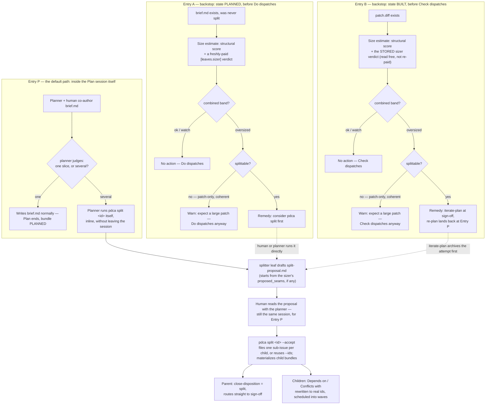

# Step 07 — Cross-cutting: size, iteration, and parallel execution

← [06 Act](06-act.md) · [Index](README.md)

Everything through [step 06](06-act.md) is one contribution moving
linearly through Plan → Do → Check → sign-off → Publish → Act. Three mechanisms
don't fit that line — they modify *how* the beats run rather than being a beat
themselves, and each one touches more than one of them:

- **Size & split** — estimates a brief's size before Do spends anything, and a
  deterministic path (owned by Plan, backstopped by the driver) to decompose
  one that's too big.
- **Iteration & carry-forward** — what actually happens on disk when a bundle
  iterates, whether a human triggered it or the driver did.
- **Parallel lanes & housekeeping** — running several cycles at once, and the
  maintenance that keeps a long-running instance from silting up.

This step gathers them in one place rather than splitting each across every
beat it touches.

---

## Size & split

[Step 03](03-plan.md#entry-and-exit-the-guards-around-plan) already covers the
**size guard** — the pre-dispatch check that can warn before Do. This section is
about the decomposition it warns you toward, and — the important part —
**splitting is owned by the Plan beat itself, not a maintenance task you run
afterward.** The planner leaf's own runtime prompt tells it: *"If this slice
turns out to be several slices, SPLIT IT IN THIS BEAT — a split produces
briefs, and briefs are yours. You do not leave the session to file issues by
hand."* The planner runs `pdca split` and `pdca split --accept` itself, inline,
with the human right there in the same interactive Plan session — the same
session that's already open to co-author `brief.md` in the first place.

### The process



**Entry P is the default; Entries A and B are backstops, not the primary path.**
The pre-dispatch size guard from step 03 still runs — once at `PLANNED` before
Do, once at `BUILT` before Check, on the same "splittable?" logic either way —
but its job now is to catch a brief that reached the driver *without* having
been split already: one seeded by hand (`--from-brief`), one planned by a
minimal or stub planner, or a session where a human judged it fine at the time
and turned out to be wrong. Both backstops feed the *same* `pdca split` /
`--accept` mechanics Entry P uses — there's one decomposition path, just two
ways of arriving at it.

**Within any entry, the same question decides split-or-not:** `splittable` is
set membership over the *readouts*, not the combined band — only if the churn
signal or the model's "independently shippable outcomes" verdict is itself
oversized, or the patch-size signal isn't the *sole* thing that fired, is a
split even offered. A brief that's oversized purely on predicted patch size —
a large but coherent change — gets a different message entirely ("expect a
large patch," not "split this"), because splitting a coherent change produces
artificial seams, not a real decomposition.

**The two backstops differ because the beat does.** At Entry A the bundle is
still just a brief, so `pdca split` runs directly. At Entry B a patch already
exists, and splitting means authoring new briefs — Plan's beat, not something
you do to a bundle mid-build — so the route back is `iterate-plan` at sign-off:
that archives the rejected attempt (Do's output isn't discarded, the same as
any other iterate — [below](#iteration--carry-forward)) and returns the bundle
to `PLANNED`, landing right back at Entry P for the re-plan.

### The estimate

`pdca size [<ids…>]` is read-only — it decides nothing, writes nothing, and is
safe to run against a live queue at any time:

```bash
pdca size 13636        # one bundle
pdca size               # every briefed bundle
```

Each bundle prints a band (`ok` / `watch` / `oversized`) plus the reasons that
fired — the reasons matter more than the band, because "3 conflicts declared"
and "predicts a large patch" call for different responses, and a bare band hides
which one it was.

The estimate has **two independent signals**, combined by deterministic code
(never a model deciding alone):

1. **Structural** — stdlib only, always available offline. A weighted score over
   five brief features, calibrated against 86 settled bundles of a real instance:

   | Feature | Weight | Why |
   |---|---|---|
   | `conflicts_with` | 3 | strongest churn signal (ρ 0.32) |
   | `difficulty_high` | 3 | `Difficulty: high` declared |
   | `ext_deps` | 3 | external dependency tokens — highest single-feature precision |
   | `brief_bytes` | 3 | brief size above a 12 KB cutoff |
   | `is_plan_pointer` | **−2** | a brief pointing at a host planning artifact converges *better* — the one de-escalating term |

   The score sorts into two separate readouts, because they answer different
   questions: **churn** (how many sign-off rounds this will take) and **patch
   size** (how big the diff will be). A large-but-coherent change scores high on
   patch size and low on churn — that's not a split candidate, it's just a big
   diff — so both bands are reported and kept distinct rather than collapsed into
   one number.
2. **Model** — the optional `[leaves.sizer]` leaf answers the one question
   structure demonstrably cannot: *how many independently shippable outcomes does
   this brief describe?* Its verdict folds in through **escalate-only**
   combination — it can raise a band structure scored low, never lower one a
   structural signal raised. A model that could downgrade would be a single point
   of failure over a signal that at least fails predictably. Its prompt is
   explicit that it only *proposes* seams — `proposed_seams` in its JSON verdict
   — and does not cut them: "the split is authored in PLAN, by the human." When a
   split does happen, the splitter leaf reads this stored verdict as a starting
   point rather than re-paying a model to rediscover what the sizer already
   found — never re-invoked, just re-read.

**Nothing here gates**, and that's a calibrated decision, not an oversight: the
best structural rule reaches 50% recall at 62% precision against ≥3 rounds —
nearly one wrong flag for every right one. `[driver].size_guard = "hold"` is
accepted but silently treated as `"warn"` for exactly this reason (see step 03).
Retune the weights and cutoffs per-instance under `[driver.sizing]` in
`pdca.toml` if your own corpus disagrees with the defaults above.

### The split

`pdca split` is the deterministic decomposition path — two verbs, because the
second is meaningless without the first — and, per the process above, the
planner leaf is normally the one typing both, from inside the Plan session:

```bash
pdca split 13636             # drafts split-proposal.md (the splitter leaf)
pdca split 13636 --accept    # files one tracker issue per child, then materializes them
```

The **splitter leaf** writes prose into `split-proposal.md`; everything after
that is plain code, no model. Each child is delimited by an HTML comment —
`<!-- pdca:child child-1 -->` … `<!-- pdca:end child-1 -->` — deliberately not a
Markdown construct, because a child's body is a **full draft brief** and may
legitimately contain `##` headings, `---` rules, or a `- **Slug:**` line that
would collide with any Markdown-shaped delimiter.

`--accept` with **no `--ids`** now files the child issues itself — one `gh
issue create --parent` per child, each a real tracker sub-issue of the parent —
rather than making anyone leave the Plan session to file them by hand and come
back with the numbers. `--ids <id>[,<id>…]` still exists for a human who's
already filed them, and is *required* on a tracker `pdca` can't reach that way
(a non-GitHub tracker fails closed with the exact fallback command printed, not
a silent skip). Either way, acceptance is **transactional**: everything is
validated *before* a single issue is filed or a file written — a tracker issue
can't be un-created, so filing three of them for a proposal that then fails to
parse is the one order that must never happen — and the bundle writes are
staged, moved into place only once every child succeeds. The proposal's own
`Depends on` / `Conflicts with` fields reference siblings by their
proposal-local label (`child-2`); acceptance rewrites those to the real
(possibly just-filed) ids, so the batch schedules into
[waves](#waves-in-execution) correctly from the first `pdca flow` on the
children.

The parent bundle doesn't just sit there afterward — it's marked via the same
[close-disposition fast path](04-do.md#the-close-disposition-fast-path) a
duplicate or wontfix uses (`close-disposition` = `split`), so it routes straight
to sign-off with a `build-notes.md` explaining the work moved to its children,
rather than pretending it still needs a builder. Reopening it (`iterate-to-Do`)
archives the split marker and re-enables the real Do+Check band, same as any
other close disposition.

---

## Iteration & carry-forward

[Step 05](05-check.md#signing-off--the-four-dispositions) covers the human
decision — `--iterate-do` / `--iterate-plan` — and the state machine
([step 00](00-introduction.md)) shows
`ITERATE_DO` / `ITERATE_PLAN` as transient states the driver resolves on its
own. This section is the mechanics common to *every* iterate, however it's
triggered.

### What actually happens on disk

Two things happen, in order, whenever a bundle iterates:

1. **Carry-forward** — before anything is archived, the driver appends a new
   `## Iteration <N> — carry-forward` heading to the *live* `brief.md`, folding
   in whatever context is available: the §9 sign-off rationale, and every
   *failing* gate line — gating **and** advisory, since an iterate is often
   driven by an advisory red rather than a gating one — plus an explicit
   instruction not to re-attempt the rejected approach unchanged. This is
   best-effort and never breaks the transition: a bundle with no recorded
   rationale still iterates, just without extra context.
2. **Archive** — the previous attempt's artifacts move into `iteration-v<N>/`
   (never deleted): everything downstream of the brief (`patch.diff`,
   `build-notes.md`, gate results, `SUMMARY.md`, the rubric snapshot), the
   advisory review files and error-log tails, and any test file the brief
   shipped *inside* the bundle. `iterate-to-Plan` additionally archives
   `brief.md` itself (with the carry-forward note now baked into it) plus the
   Plan-advisory artifacts, which is what actually drops the bundle back to
   `UNPLANNED` for you to re-author.

One deliberate wrinkle ties this back to [Size & split](#size--split): the
structural size estimate measures the brief **above** that carry-forward
heading, never the file as it stands after several iterations. Measuring the
raw file would leak the outcome into the predictor — an iterating bundle's brief
is larger *because* it churned, not because it started large — so the same
heading both mechanisms use is the one place they have to agree.

### The iteration budget

`[driver].max_passes` (default `20`) bounds how many build→sign-off passes one
`pdca flow` run gives a bundle before it stops driving it — not silently: the
bundle is named on stderr with a `pdca flow <id>` resume hint, and its accepted
siblings still publish. Raise it in `pdca.toml` rather than editing anything.

### Auto-iterate: the driver deciding for itself

Every implementation defect the reviewer catches — a logic slip, a weak test, a
red gate — parks a bundle at `AWAITING_SIGNOFF` and asks a human to press
`iterate-do`, which is a decision the driver is often positioned to make itself.
`[driver].auto_iterate` (default `false` — opt in) lets it: when Check's §6 has
**at least one mechanically-checkable ("IMPL") finding and nothing else you'd
need to see first**, the driver writes `iterate-do` and rebuilds, unattended.

The eligibility split rides on the same `input | gate | judgment` tag every §6
item already carries: the `gate` cells (C2 reproduction, C4 verification,
T1–T4 conformance) are IMPL — a rebuild can plausibly fix them; the `judgment`
cells (C5 causal adequacy, T5, the validation act) and the `input` cells (C1
spec, C3 change) stay HUMAN. One exception makes this fire at all in practice:
the reviewer's `Validation — fitness-to-purpose` row is hard-coded to
NEEDS-HUMAN on *every* cycle by design, so it's a constant, carries no signal,
and doesn't veto a rebuild — though it's still rendered in §6 and you still have
to clear it to accept.

Three guarantees hold by construction, worth knowing before you flip it on:

- **It only ever writes `iterate-do`.** Never accept, never discontinue — those
  stay authored solely by a human's `pdca signoff`, going through the same
  C6-guarded decision path either way.
- **It never ticks a §6 box.** An auto-iterate archives the whole SUMMARY,
  unticked, into `iteration-v<N>/`; the rebuild produces a fresh §6 from
  scratch.
- **It's bounded.** `[driver].max_auto_iters` (default `3`) automatic rounds per
  bundle, tracked in `auto-iterate.json` — deliberately *not* archived, so the
  count survives across rebuilds instead of resetting every iterate. On
  exhaustion the bundle halts at `AWAITING_SIGNOFF` for you, same as always,
  never dropped.

gramps runs `auto_iterate = true` with the default `max_auto_iters = 3`.

---

## Parallel lanes & housekeeping

### Lanes

`[driver].lanes` (default `1` — strictly serial) sizes a worker pool for the
**unattended Do+Check band only** — Plan, sign-off, publish, and Act stay
serial regardless. A pool of N runs N bundles concurrently in one workspace;
each worker is pinned to a fixed slot `0..N-1`, exposed to every gate command as
`$PDCA_LANE`. Any gate that touches a shared mutable resource — a target
checkout it applies/reverts, a container, a port — **must** namespace that
resource by `$PDCA_LANE` (`--name app-l$PDCA_LANE`, a `repo-lane$PDCA_LANE`
checkout) or two lanes collide. Override per-run without touching `pdca.toml`:
`PDCA_LANES=N` or `--lanes N` on `pdca flow`. Several standalone `pdca flow <id>`
processes can also share one workspace this way — each auto-claims a free lane
via a lockfile, or is pinned explicitly with `PDCA_LANE=k`.

Each cycle's Do+Check runs in a dedicated git worktree off the target's base
(`[driver].worktree`, default `true`) so the primary checkout is never mutated
in place — exposed as `$PDCA_WORKTREE`, and gate commands should target that,
not the primary checkout. `[driver].overflow` (default `0`) caps a pool of
throwaway worktrees for the exceptional case: an out-of-cadence gate re-read
against a lane another bundle currently owns spins up a fresh throwaway tree
instead of clobbering that lane.

Before any lane spawns, the harness verifies the resources they need actually
exist — the same `per_lane` `[[doctor.checks]]` rows from
[step 01](01-render-and-integrate.md#pdca-doctor--verify-prerequisites-change-nothing)
run automatically, or a `lane_preflight` command covers a resource that isn't
expressible as a doctor row. Either way, a missing lane aborts the whole run
*before* it produces a pile of false-red bundles, not partway through. gramps
runs `lanes = 6`, backed by `make worktrees LANES=6` provisioning the sibling
checkouts those doctor rows check for.

### Waves in execution

[Step 03](03-plan.md#ordering-and-routing-the-batch) covers *declaring* the
shape — `Depends on` / `Conflicts with` on the brief. This is what the driver
does with that declaration once a batch actually runs: bundles in the same wave
build in parallel; each wave's *accepted* result then becomes the base the next
wave builds on, via `[driver].wave_mode`:

- **`"stack"`** (default, fork-safe) — folds each wave's accepted patches onto a
  run-scoped integration branch the next wave builds on, and opens every PR as a
  stacked PR. Push-only, so it works from a fork with no merge rights, and it
  keeps STOP discipline — the harness never merges anything; you merge the PR
  stack bottom-up with a merge commit (never squash, or the stack's history
  breaks).
- **`"merge"`** (own-repo / continuous-delivery only) — actually `gh pr merge`s
  each non-final wave's PRs, so the next wave builds on a genuinely merged base.
  Needs merge rights on the base remote and relaxes STOP discipline for the
  batch; fails closed if a PR turns out non-mergeable. `[driver].merge_method`
  picks the merge strategy (`"merge"` / `"squash"` / `"rebase"`).

`[driver].regate_between_waves` (default `false`) optionally re-runs your
repo-scoped gates over each folded integration tip before the next wave builds
on it — catching a combination that's red even though every fix in it was green
alone. gramps runs the default `wave_mode = "stack"` with `merge_method =
"merge"` for when a human merges the stack.

### Housekeeping: sweep & cleanup

Two maintenance commands, on two different axes — one is disk footprint, the
other is tracker sync — and neither should run mid-flow (both can race a live
session):

**`pdca sweep`** reclaims the harness's *own* worktree/build footprint — lane
worktrees, integration worktrees, orphaned overflow trees — never bundle
artifacts, never the primary checkout. It runs automatically at the
publish/freeze boundary (once a run's waves complete) and on demand:

```bash
pdca sweep             # per [driver].sweep_worktrees
pdca sweep --dry-run    # report what would be reclaimed, touch nothing
pdca sweep --remove     # remove lane worktrees too, not just their build state
```

`[driver].sweep_worktrees` sets the automatic behaviour: `"clean"` (default —
strip build state via `git clean -fdxq` + `reset --hard`, keep the checkouts
warm; remove integration/overflow trees outright since they never get reused
anyway), `"remove"` (lane worktrees go too — Do / `pdca try` recreate on
demand), or `"off"` (never sweep automatically; `pdca sweep` still works
explicitly). This exists because it's a real failure mode, not a hypothetical
one: a long-running instance let its lane build dirs (`target/`, `node_modules/`,
…) accumulate past 200 GB, and *gating* gates started false-redding with `Disk
quota exceeded` — an environment fault that read, at first, like a real
regression in the patch.

**`pdca cleanup`** reconciles bundle state against the **issue tracker** instead
— a different drift entirely: an issue closed by decision in-thread while its
bundle still sits pending, a bundle frozen `COMPLETE` while its issue stays
open, a PR merged while sign-off is still outstanding. Dry-run by default;
`--apply` executes:

```bash
pdca cleanup            # report every discrepancy, change nothing
pdca cleanup --apply    # execute the matched actions below
```

| Local state | Remote state | Action |
|---|---|---|
| briefless (notes-only) | issue CLOSED | writes `notes.json`'s `resolved` record → bundle reads `RESOLVED` ([step 00](00-introduction.md)) |
| `AWAITING_SIGNOFF` | issue CLOSED | records §9 `discontinue` (the same primitive as `pdca signoff --discontinue`) |
| mid-flight (`PLANNED`/`BUILT`/`CHECKED`/iterating) | issue CLOSED | **report only** — fabricating a §9 for in-flight work isn't auditable |
| not `COMPLETE` | PR MERGED | **report only, always** — never auto-writes an accept past the C6 guard |
| `COMPLETE` with a merged PR | issue OPEN | comments + closes the issue |
| `COMPLETE` (close/no-fix) or `DISCONTINUED` | issue OPEN | comments + closes the issue |
| `COMPLETE` with an unmerged PR | issue OPEN | **report only** — stays open until the PR actually merges |

This is where the `RESOLVED` state from [step 00](00-introduction.md) actually
gets **written** in practice — Plan never fabricates it, `pdca cleanup` is the
one command that does, and only for a bundle that never entered a cycle. Every
write here goes through the same three primitives regardless: the `notes.json`
merge, `signoff.record` + a normal driver run, or a `gh issue` comment/close —
nothing here invents a fourth path to a verdict. `gh` missing or unauthenticated
aborts the whole command before any write.

---

You now have the full picture: the linear cycle from [step 00](00-introduction.md)
through [step 06](06-act.md), plus the three mechanisms that cut across it.
From here, [render the harness into your own project](01-render-and-integrate.md)
if you haven't, or go back to the [reference spec](../template/PCDA/quality-cycle/)
for the full reasoning behind any of it.

← [06 Act](06-act.md) · [Index](README.md)
