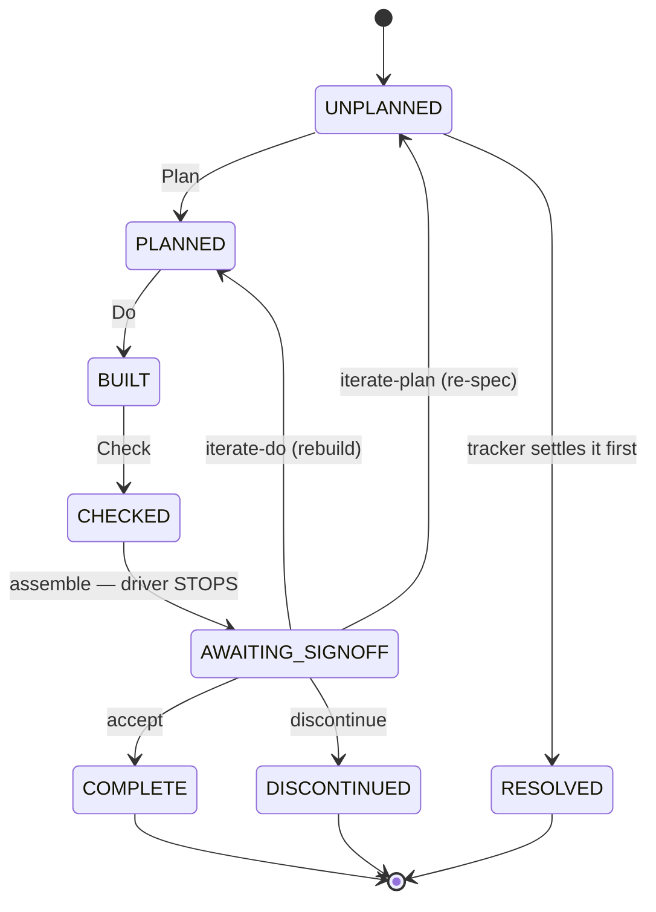

# Worked example — driving the PDCA cycle with the harness

This folder is a **tutorial**. It walks you through using the `pdca-harness`
template end-to-end, using a real project — [**Gramps Testbed
v2**](https://github.com/eduralph) — as the worked example at every step.

The harness itself (the driver, the templates, the generic model docs) lives in
[`../template/`](../template/). The canonical *reference* for the model is the
vendored spec in
[`../template/PCDA/quality-cycle/`](../template/PCDA/quality-cycle/) (files
`00`–`10`). **This folder is the opposite of reference material**: instead of
"here is what each artifact means", it shows "here is what a maintainer actually
typed, what the harness produced, and the real decisions they made" on a live
codebase.

> Everything quoted here — briefs, gate tables, sign-off lines, the Act log — is
> copied verbatim from the gramps-testbed-v2 instance. Paths look like
> `results/issue_11589/SUMMARY.md`; those are real files in that repo.

## What the harness is, in one paragraph

One contribution turns one **PDCA cycle**: **Plan** (author the spec) → **Do**
(implement) → **Check** (verify the built artifact against the spec —
correctness, conformance, *and* validation) → **Act** (improve the process so the
issues this cycle exposed don't recur). A deterministic **driver** advances a
*bundle* (a folder under `results/issue_<id>/`) through a file-derived state
machine and **stops only at the three points where a human is irreducible**:
authoring the Plan, signing off the Check, and the cross-cycle Act review.
Everything between those points is automated.



The five **halted** states — `UNPLANNED`, `AWAITING_SIGNOFF`, `COMPLETE`,
`DISCONTINUED`, `RESOLVED` — are where the driver hands control back. Everything
else it advances through unattended.

## The steps

Read these in order. Each maps to one beat of the cycle (or one setup step) and
shows the real gramps-testbed-v2 artifact it produces.

| # | Step | Beat | What you do / what the harness produces |
|---|------|------|------------------------------------------|
| [00](00-introduction.md) | Introduction | — | Why the harness exists — the problem, the benefits, the features, the vocabulary |
| [01](01-render-and-integrate.md) | Render & integrate | — | `copier copy` the template; fill `docs/INTEGRATION.md`; wire gates and leaves in `pdca.toml` |
| [02](02-rehearse-offline.md) | Rehearse offline | — | Drive the bundled `TOY` issue with stub leaves + stub gates — no model, no live gates, instant |
| [03](03-plan.md) | Plan | **P** | Author `brief.md` — the contribution spec (real: gramps issue 11589) |
| [04](04-do.md) | Do | **D** | Builder writes `patch.diff` + the test + `build-notes.md` |
| [05](05-check.md) | Check (gates, reviewer, sign-off, publish) | **C** | Gates + reviewer run; you record §9 (`--accept` / `--iterate-do` / `--iterate-plan` / `--discontinue`, real: issue 46's two iterations); accept publishes a draft PR |
| [06](06-act.md) | Act | **A** | The cross-cycle review that turns recurring misses into spec/gate/rule deltas |
| [07](07-crosscutting.md) | Cross-cutting | — | Mechanisms that span beats, not owned by one: size & `pdca split`, iteration/carry-forward + auto-iterate, parallel lanes, sweep & cleanup |

## The whole cycle in one command

Once a repo is integrated, a maintainer rarely types the per-beat commands. The
front door is the **console script** (`pdca`, named per the project):

```bash
pdca flow 13636               # Plan → Do → Check → sign-off → publish, for one issue
pdca flow 13636 13637 13638   # several ids → batch; unbriefed are auto-planned
pdca flow --from-csv issues.csv   # one Plan session briefs SEVERAL from the export, then drives all
pdca status                   # every bundle and its state (also the bare `pdca`)
```

The per-beat detail in steps 03–06 is what `pdca flow` orchestrates for you —
worth understanding once, even though you'll mostly drive from the top.

## Prerequisites (for a live run)

The offline rehearsal in [step 02](02-rehearse-offline.md) needs only Python
3.11+. A *live* cycle additionally needs:

- **An agent CLI for the leaves.** The Plan, Do, Check-reviewer, sign-off,
  publish, and Act beats run as configured subprocesses ("leaves") — arbitrary
  commands set in `pdca.toml`, so the model is the harness's choice, not a
  requirement. The cycle model itself is **model-agnostic**; it even recommends a
  *cross-vendor* reviewer (the template defaults the builder to Claude and the
  reviewer to Codex). The worked example uses the **Claude CLI** (`claude`)
  installed and authenticated.
- Whatever your **gates** need. For gramps that's **Docker** (the test suites run
  in a container) and the sibling fork checkouts (`../gramps`,
  `../addons-source`). Your project's gates will differ — you define them in
  [step 01](01-render-and-integrate.md).
- `git` and (for publishing) the `gh` CLI.

New to the harness? Start with [step 00](00-introduction.md) for the *why*. Ready
to set it up? Go to [step 01](01-render-and-integrate.md). Just want to see the
driver move a bundle with no model or gates wired up? Jump to
[step 02](02-rehearse-offline.md).
